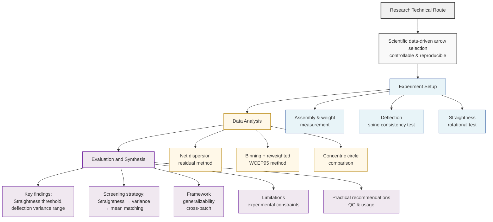
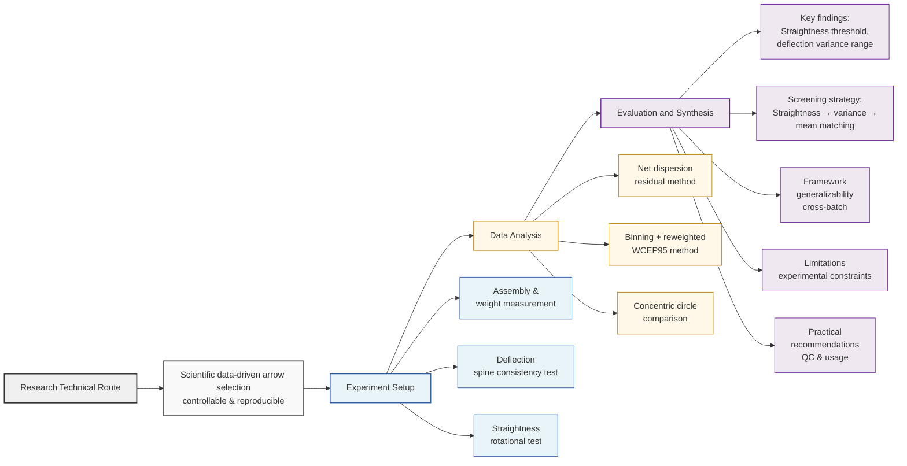

# 研究技术路线图

## 核心目标
**Scientific data-driven arrow selection (controllable & reproducible)**
科学数据驱动的箭矢选择（可控且可复现）

---

## Research Technical Route Flowchart

### Alternative Layout (More Compact for Paper)

---

## 详细说明

### 一、实验设置 (Experiment Setup)

1. **Assembly & weight measurement**
   组装与重量测量

2. **Deflection (spine consistency test)**
   挠度（脊柱一致性测试）

3. **Straightness (rotational test)**
   直度（旋转测试）

---

### 二、数据分析 (Data Analysis)

1. **Net dispersion residual method**
   净离散残差法

2. **Binning + reweighted WCEP95 method**
   分箱 + 加权 WCEP95 方法

3. **Concentric circle comparison**
   同心圆比较

---

### 三、评估与综合 (Evaluation and Synthesis)

1. **Key findings: Straightness threshold, deflection variance range**
   关键发现：直度阈值，挠度方差范围

2. **Screening strategy: Straightness -> variance -> mean matching**
   筛选策略：直度 -> 方差 -> 平均值匹配

3. **Framework generalizability (cross-batch)**
   框架通用性（跨批次）

4. **Limitations (experimental constraints)**
   局限性（实验约束）

5. **Practical recommendations (QC & usage)**
   实用建议（质量控制与使用）

---

## 研究流程总结

这是一个完整的箭矢选择研究流程，从数据采集（实验设置）到数据处理（数据分析），再到最终的综合评估和应用建议。整个流程强调数据驱动、可控性和可复现性。

### 逻辑流程：
1. **实验设置阶段**：进行箭矢的组装、重量测量、挠度和直度测试，获取原始数据
2. **数据分析阶段**：使用多种统计方法（残差法、加权方法、同心圆比较）处理和分析数据
3. **评估与综合阶段**：总结关键发现、提出筛选策略、讨论通用性、指出局限性并提供实用建议

